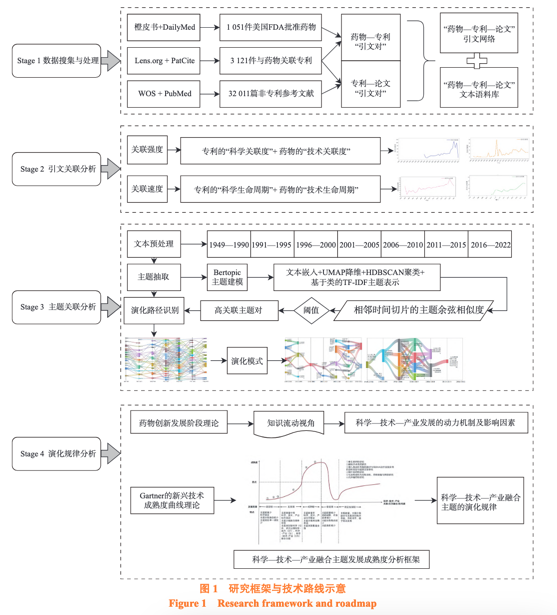

# 参考

[pdf](./刘春丽 等 - 2024 - 科学—技术—产业关联测度与主题演化规律研究——以生物医药领域为例.pdf)

**意义：** 科学、技术、产业之间相互关联,互为促进。特别是在生物医药领域,科学研究与专利技术的紧  密关联加速推进了制药产业的创新发展。然而,科学研究、专利技术、药物产品之间如何关联及科学—技术产业融合主题如何演化尚不明确。

**结论：** 研究发现,科学关联度与技术关联度均呈逐年上升趋势,而科学—技术  的关联速度及技术—产业的关联速度却有逐年下降的趋势;基于科学—技术—产业融合主题及其演化路径,定  义 6 种主题演化模式;在剖析科学—技术—产业发展动力机制基础上,构建科学—技术—产业融合主题发展成  熟度的分析框架,发现生物医药领域科学—技术—产业的知识关联与协同驱动可促进科学—技术—产业之间的  知识交换,加快新技术的开发和转化,从而推动生物医药产业的创新发展。

**政策引导：** 近年来,以习近平  同志为核心的党中央高度重视科技创新助力健康中  国建设,提出加快科技创新,提升人民健康福祉。

**研究方法：**  

